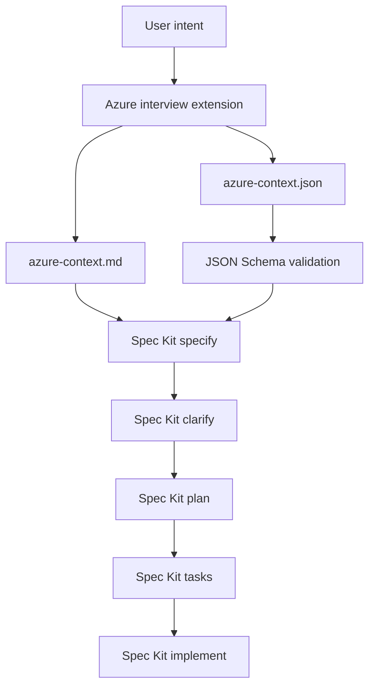
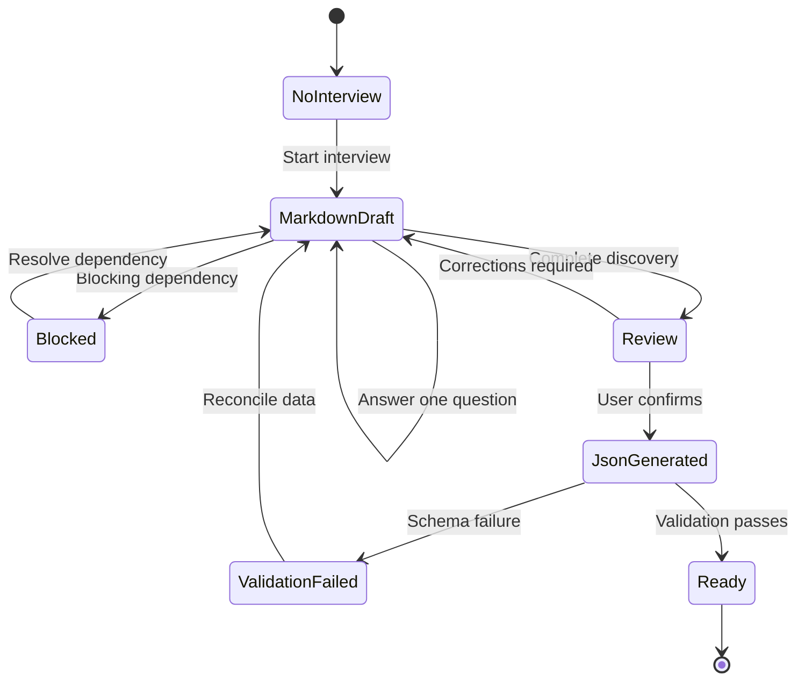
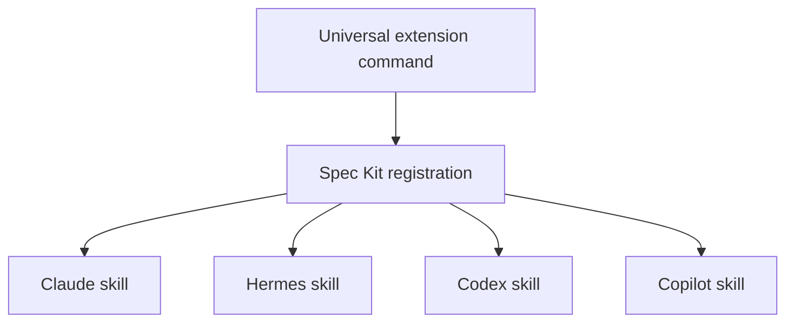
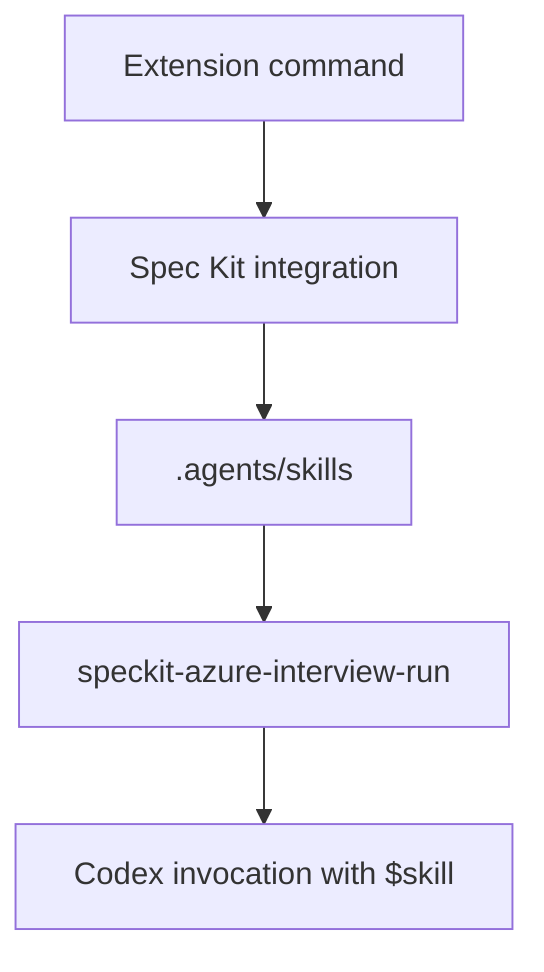

# Architecture

## Overview

Spec Kit Azure Interview is an isolated Spec Kit extension that adds a
pre-specification Azure discovery phase.

It does not fork, patch, wrap, or override Spec Kit Core.



## Architectural Boundaries

### Extension-owned components

The extension owns:

- `speckit.azure-interview.run`
- The adaptive interview instructions
- The Markdown discovery template
- The JSON Schema
- The JSON validation utility
- The optional Hermes custom-home adapter
- Extension documentation and tests

### Spec Kit-owned components

Spec Kit Core owns:

- Constitution generation
- Specification generation
- Specification clarification
- Implementation planning
- Checklist generation
- Task generation
- Cross-artifact analysis
- Implementation

The extension must not modify Core-owned commands or templates.

### Consuming-project components

A consuming project owns:

```text
.specify/discovery/azure-context.md
.specify/discovery/azure-context.json
```

These artifacts describe one workload and are not part of the reusable extension
package.

## Component Model

| Component | Responsibility | Mutability |
|---|---|---|
| `extension.yml` | Declares commands, templates, scripts, and compatibility | Release controlled |
| `commands/azure-interview.md` | Defines interview behaviour and safeguards | Release controlled |
| Markdown template | Defines the human-readable interview structure | Release controlled |
| JSON Schema | Defines the machine-readable handoff contract | Release controlled |
| Context validator | Validates completed JSON handoff artifacts | Release controlled |
| Hermes adapter | Bridges custom `HERMES_HOME` layouts | Optional and user controlled |
| Markdown context | Stores the evolving interview | Project mutable |
| JSON context | Stores the validated handoff | Project mutable after confirmation |

## Artifact Lifecycle



The Markdown artifact exists throughout the interview. The JSON artifact is
generated only when its required properties can be populated without invented
values or placeholders.

## Interview State

The interview distinguishes:

- Facts
- Requirements
- Constraints
- Decisions
- Assumptions
- Recommendations
- Dependencies
- Open questions

These classifications prevent the AI agent from silently promoting uncertain
information into implementation requirements.

## Existing Resource Model

Existing-resource handling uses two independent dimensions.

### Lifecycle intent

```text
discover | reuse | create | migrate | replace
```

### Modification permission

```text
modifiable: true | false
```

For example, an existing central Private DNS zone may have:

```yaml
intent: reuse
modifiable: false
```

This means the solution may reference the zone but may not manage or alter it.

## Readiness Gate

The readiness gate prevents specification handoff when material uncertainty
remains.

A handoff requires:

- Confirmed purpose, users, scope, and success criteria
- Known deployment lifecycle and environments
- Sufficient Azure estate boundaries
- Known network and DNS ownership
- Classified existing resources
- Explicit modification permissions
- Confirmed identity and security responsibilities
- Known operational and delivery expectations
- Explicit prohibited changes
- No blocking question
- No critical unvalidated assumption
- No unresolved material contradiction
- User confirmation
- Successful JSON Schema validation

## Security Boundary

The interview is discovery-only.

It may:

- Read approved project files
- Record user-provided information
- Perform explicitly approved read-only Azure discovery
- Create project-local discovery artifacts

It may not:

- Deploy Azure resources
- Run Azure What-If
- Change Azure resources
- Change RBAC or Azure Policy
- Retrieve secret values
- Generate credentials
- Generate implementation code during the interview

## Integration Model

Spec Kit converts the universal extension command into the native representation
required by each supported AI integration.



The extension source remains agent-neutral.

### Codex integration

Spec Kit generates the extension command as a project-local Codex-compatible
skill:

```text
.agents/skills/speckit-azure-interview-run/SKILL.md
```

The Codex integration uses the shared `.agents/skills` convention rather than a
`.codex/skills` directory.



The user invokes the generated skill with:

```text
$speckit-azure-interview-run
```

Codex support does not require a separate adapter because the current Spec Kit
integration generates the project-local skill directly.

Spec Kit owns the integration-specific representation. This extension remains
responsible for:

- Provider-independent interview instructions
- The Markdown discovery template
- The machine-readable JSON Schema
- Schema and semantic validation
- Readiness-gate behavior

Codex filesystem approvals remain outside the extension boundary. The user must
review and authorize requested project access.

The extension does not:

- Grant Codex filesystem access.
- Broaden Codex sandbox permissions.
- Persist Codex approval decisions.
- Access files outside the consuming project by design.
- Authorize Azure access or deployment operations.

During the interview, normal write access is limited to:

```text
.specify/discovery/azure-context.md
.specify/discovery/azure-context.json
```

The JSON artifact is created only when the interview can pass the readiness
gate.

### Hermes custom-home compatibility

Spec Kit may generate Hermes skills under:

```text
%USERPROFILE%\.hermes\skills
```

A customized Hermes installation may load skills from:

```text
%HERMES_HOME%\skills\<category>
```

The optional adapter copies the Spec Kit-generated skill into the active Hermes
profile. It does not maintain separate interview instructions.

## Packaging Model

`.extensionignore` excludes:

- Git metadata
- Virtual environments
- Test suites
- CI workflows
- Development configuration
- Generated project artifacts

The installed extension retains only runtime-relevant code, templates,
requirements, documentation, and metadata.

## Compatibility Strategy

The extension uses:

- A unique extension ID: `azure-interview`
- A namespaced command: `speckit.azure-interview.run`
- A declared Spec Kit version range
- Semantic Versioning
- Contract tests
- Cross-platform Python tests
- Integration smoke tests

Future Spec Kit changes should be handled by updating the extension compatibility
range and adapter code rather than modifying Spec Kit Core.