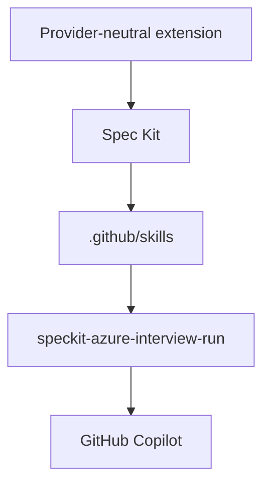

# GitHub Copilot Integration

This guide explains the preview support for using Spec Kit Azure Interview with
GitHub Copilot.

## Support Status

GitHub Copilot support is currently classified as:

```text
Preview — structurally verified; behavioral testing requested
```

The following behavior has been verified without consuming paid Copilot usage:

- GitHub Spec Kit accepts `--integration copilot`.
- Spec Kit initializes the GitHub Copilot integration.
- Spec Kit installs the released Azure Interview extension.
- Spec Kit auto-registers the Azure interview skill.
- The generated `SKILL.md` contains the complete interview instructions.
- The generated skill name and invocation separator are correct.

The following behavior has not yet been verified by the project maintainer:

- Copilot following the full adaptive interview.
- Copilot isolating the first business-purpose question and then asking adaptive numbered batches.
- Copilot maintaining the Markdown artifact across multiple turns.
- Copilot delaying JSON generation until final readiness.
- Copilot respecting every Azure discovery and safety guardrail.
- Copilot handing the validated context to the remaining Spec Kit workflow.

Community testing and feedback are therefore explicitly requested.

## Tested Structural Configuration

| Component | Tested version or status |
|---|---|
| GitHub Spec Kit CLI | `1.0.7.dev0` |
| Spec Kit Azure Interview | `0.2.0` |
| GitHub Copilot runtime | Not behaviorally tested |
| Operating system | Windows |
| Shell | PowerShell 7 |
| Integration result | Successful |
| Skill generation | Successful |

Version `0.3.0` introduces documented Copilot preview support. The initial
structural verification was performed using extension version `0.2.0`.

## Integration Model

Spec Kit generates GitHub Copilot skills under:

```text
.github/skills/
```

The Azure interview skill is generated at:

```text
.github/skills/speckit-azure-interview-run/SKILL.md
```

The extension remains installed under:

```text
.specify/extensions/azure-interview/
```

The resulting architecture is:



Spec Kit owns the Copilot-specific skill generation. The extension remains
provider-neutral and does not contain a separate Copilot implementation.

## GitHub Copilot Agent Skills

GitHub Copilot agent skills are folders containing a `SKILL.md` file with
specialized instructions.

Copilot can select an applicable skill based on the user prompt and the skill
description. A user can also explicitly request a skill by including its name
with a forward slash.

For this extension, the explicit skill reference is:

```text
/speckit-azure-interview-run
```

A natural-language form may also be used:

```text
Use the /speckit-azure-interview-run skill to start a new Azure architecture interview.
```

Official GitHub documentation:

<https://docs.github.com/en/copilot/concepts/agents/about-agent-skills>

## Prerequisites

Install:

- Git
- Python 3.11 or later
- `uv`
- GitHub Spec Kit CLI
- Visual Studio Code with GitHub Copilot, GitHub Copilot CLI, or another
  Copilot surface supporting agent skills
- An applicable GitHub Copilot entitlement for behavioral use

Generating and inspecting the Spec Kit integration files does not require
running a paid Copilot conversation. Behavioral testing does require access to
a supported Copilot runtime.

## Install Original GitHub Spec Kit

Install the stable package:

```powershell
uv tool install specify-cli
```

Upgrade an existing installation:

```powershell
uv tool upgrade specify-cli
```

Verify:

```powershell
specify --version
specify check
specify self check
```

## Initialize a Copilot Spec Kit Project

Run from the consuming workload repository:

```powershell
specify init --here --integration copilot --script ps
```

Expected output includes:

```text
Selected coding agent integration: copilot
Install integration (GitHub Copilot)
Project ready.
```

Verify the integration record:

```powershell
Get-Content .\.specify\integration.json
```

Expected values include:

```json
{
  "installed_integrations": [
    "copilot"
  ],
  "integration_settings": {
    "copilot": {
      "script": "ps",
      "invoke_separator": "-"
    }
  },
  "integration": "copilot",
  "default_integration": "copilot"
}
```

## Install Spec Kit Azure Interview

Install the immutable `v0.7.0` release archive:

```powershell
specify extension add azure-interview `
    --from https://github.com/RobertAgterhuis/speckit-azure-interview/archive/refs/tags/v0.8.0.zip
```

Spec Kit displays an untrusted-source warning because this extension is installed
outside the official Spec Kit extension catalog.

Review the source URL and confirm with `y` only when you trust:

```text
https://github.com/RobertAgterhuis/speckit-azure-interview
```

Verify:

```powershell
specify extension list
specify extension info azure-interview
```

Expected canonical command:

```text
speckit.azure-interview.run
```

Expected installation result:

```text
1 agent skill(s) auto-registered
```

## Verify the Generated Copilot Skill

List the generated skills:

```powershell
Get-ChildItem .\.github\skills -Directory |
    Select-Object Name, FullName
```

Expected:

```text
speckit-azure-interview-run
```

Inspect the generated skill:

```powershell
Get-Content `
    .\.github\skills\speckit-azure-interview-run\SKILL.md `
    -TotalCount 20
```

Expected frontmatter includes:

```yaml
name: speckit-azure-interview-run
description: Conduct an adaptive Azure architecture interview before specification
```

Verify the expected content:

```powershell
Select-String `
    -Path .\.github\skills\speckit-azure-interview-run\SKILL.md `
    -Pattern "Azure Architecture Interview|business capability|azure-context"
```

## Install the Runtime Dependency

Create and activate a project-local virtual environment:

```powershell
python -m venv .venv
.\.venv\Scripts\Activate.ps1
```

Install the validator dependency:

```powershell
python -m pip install `
    -r .\.specify\extensions\azure-interview\requirements-runtime.txt
```

## Establish the Constitution

Before starting the Azure interview, establish the project constitution using
the Copilot form of the generated Spec Kit skill:

```text
Use the /speckit-constitution skill.

Define the governing principles for an AVM-based Azure IaC solution. Require secure-by-default design, least privilege, private connectivity where appropriate, reusable modules, automated validation, documented ownership boundaries, and no deployment without review.
```

Review:

```text
.specify/memory/constitution.md
```

Do not continue while the constitution contains only placeholder values.

## Start the Azure Architecture Interview

Use:

```text
Use the /speckit-azure-interview-run skill.

We need an AVM-based Bicep solution for a production workload that must integrate with an existing Azure landing zone. Start a new Azure architecture interview.
```

Copilot should explicitly use or acknowledge:

```text
speckit-azure-interview-run
```

## Expected First-Turn Behavior

Copilot should:

1. Read the generated interview skill.
2. Inspect the Spec Kit project structure.
3. Read the project constitution.
4. Read the Azure context Markdown template.
5. Read the JSON Schema.
6. Check for existing discovery artifacts.
7. Record only confirmed input.
8. Create or update `.specify/discovery/azure-context.md`.
9. Keep unknown values explicit.
10. Ask exactly one business-purpose question.

The first primary question should be equivalent to:

```text
What specific business capability or problem must this workload address?
```

Copilot must not yet:

- Ask for hub-spoke details.
- Ask for subscriptions or resource names.
- Access Azure.
- Retrieve secrets.
- Generate Bicep or Terraform.
- Run an Azure deployment.
- Run Azure What-If.
- Create `azure-context.json`.
- Mark the interview ready for specification.

## Continue the Interview

Answer the opening business-purpose question first. Later responses may answer
a numbered batch of two to four related questions. Partial answers are allowed;
unanswered numbers remain open.

The interview should continuously maintain:

```text
.specify/discovery/azure-context.md
```

It should distinguish:

- Facts
- Requirements
- Decisions
- Assumptions
- Open questions
- Dependencies
- Prohibited changes
- Readiness blockers

Copilot should resume an existing interview unless the user explicitly requests
a separate interview.

## Validate Readiness

When Copilot reports that the interview is complete, confirm that both artifacts
exist:

```text
.specify/discovery/azure-context.md
.specify/discovery/azure-context.json
```

Validate the JSON:

```powershell
python .\.specify\extensions\azure-interview\scripts\python\validate_context.py `
    .\.specify\discovery\azure-context.json `
    --schema .\.specify\extensions\azure-interview\templates\azure-context.schema.json
```

Expected:

```text
VALID: <absolute-path-to-azure-context.json>
```

Do not continue when validation fails.

## Specification Handoff

After successful validation, invoke the core Spec Kit specification skill:

```text
Use the /speckit-specify skill.

Use .specify/discovery/azure-context.md and .specify/discovery/azure-context.json as authoritative discovery input. Preserve confirmed requirements, ownership boundaries, existing-resource lifecycle intent, constraints, and prohibited changes. Do not treat assumptions as facts and do not invent missing Azure details.
```

Continue with the generated Copilot skills:

```text
/speckit-clarify
/speckit-plan
/speckit-checklist
/speckit-tasks
/speckit-analyze
/speckit-implement
/speckit-converge
```

Clarify and Checklist are optional. Analyze and Converge are recommended for
production Azure IaC.

## Structural Acceptance Criteria

Copilot structural compatibility is healthy when:

- Spec Kit initializes with `--integration copilot`.
- `.github/skills` contains the core Spec Kit skills.
- `.github/skills/speckit-azure-interview-run/SKILL.md` exists.
- The skill has the correct name and description.
- The extension reports one auto-registered agent skill.
- The complete interview instructions are present.
- The extension templates and validator are installed.
- No Copilot-specific fork of the interview instructions exists.

These checks do not prove that a Copilot model follows every instruction.

## Behavioral Acceptance Criteria

Community behavioral testing should verify that Copilot:

- Activates the intended skill.
- Creates the Markdown discovery artifact.
- Asks one opening business-purpose question followed by adaptive batches of no more than four related questions.
- Starts with business purpose.
- Adapts later questions to previous answers.
- Tracks contradictions.
- Separates facts from assumptions.
- Does not invent Azure resource identifiers.
- Delays JSON generation until final readiness.
- Passes schema and semantic validation.
- Does not generate IaC during the interview.
- Does not access or modify Azure without explicit approval.
- Produces a reliable handoff to `/speckit-specify`.

## Known Limitation

The project maintainer has not yet completed a behavioral test using a paid
GitHub Copilot runtime.

GitHub Copilot support must therefore not be described as fully behaviorally
verified until community or maintainer evidence confirms the acceptance
criteria.

This limitation affects the support classification, not the verified structural
installation.

## Community Testing Requested

If you have access to GitHub Copilot, please test the workflow and report:

- Copilot product and surface used
- Copilot plan, when relevant
- Selected model
- Visual Studio Code or Copilot CLI version
- Spec Kit CLI version
- Extension version
- Operating system
- Shell
- Exact invocation prompt
- Whether the skill was activated
- First interview question
- Files created
- Whether JSON was created prematurely
- Any safety or instruction-following problem

Sanitize all output before sharing it.

Do not include:

- Secrets
- Tokens
- Tenant IDs
- Subscription IDs
- Confidential resource names
- Internal network ranges
- Personally identifiable information

## Reporting Results

Open a behavioral-test discussion:

<https://github.com/RobertAgterhuis/speckit-azure-interview/discussions>

Report a reproducible problem:

<https://github.com/RobertAgterhuis/speckit-azure-interview/issues>

When reporting a bug, use the GitHub Copilot integration details and indicate
whether the problem is:

- Installation
- Skill discovery
- Skill invocation
- Interview behavior
- Artifact generation
- Readiness validation
- Specification handoff

## Troubleshooting

### `.github/skills` Does Not Exist

Confirm that the project was initialized with:

```powershell
specify init --here --integration copilot --script ps
```

Inspect:

```powershell
Get-Content .\.specify\integration.json
```

### The Azure Interview Skill Is Missing

Verify the extension:

```powershell
specify extension list
specify extension info azure-interview
```

Reinstall the released extension only after reviewing the target project:

```powershell
specify extension add azure-interview `
    --from https://github.com/RobertAgterhuis/speckit-azure-interview/archive/refs/tags/v0.8.0.zip `
    --force
```

### Copilot Does Not Select the Skill

Reference the skill explicitly:

```text
Use the /speckit-azure-interview-run skill to start a new Azure architecture interview.
```

Confirm that the generated skill description matches the requested task.

### Copilot Creates JSON Too Early

Stop the interview and report the behavior.

Before readiness, only this artifact should be required:

```text
.specify/discovery/azure-context.md
```

### Copilot Generates IaC During the Interview

Stop the session and report the prompt and sanitized output.

Infrastructure implementation belongs to the later
`/speckit-implement` stage, not the Azure interview.

## References

- [Spec Kit Azure Interview](https://github.com/RobertAgterhuis/speckit-azure-interview)
- [GitHub Copilot agent skills](https://docs.github.com/en/copilot/concepts/agents/about-agent-skills)
- [Adding agent skills for GitHub Copilot CLI](https://docs.github.com/en/copilot/how-tos/copilot-cli/customize-copilot/add-skills)
- [Original GitHub Spec Kit](https://github.com/github/spec-kit)
- [Azure Verified Modules Spec Kit guidance](https://azure.github.io/Azure-Verified-Modules/experimental/ai-assisted-sol-dev/spec-kit/)

## Generate the Intended Azure Design

After the interview is complete and the machine-readable context is validated,
run:

    /speckit.azure-interview.design

GitHub Copilot generates the installed skill:

    speckit-azure-interview-design

The design command produces a validated intended-state model plus Markdown,
Mermaid, SVG, and editable Draw.io review artifacts.

The initial status is `designStatus: intended` and
`reviewStatus: unreviewed`. Generation does not approve the design and does not
prove deployed Azure state.

Review planned resources, reused resources, ownership boundaries, networking,
private endpoints, diagnostics, and dependencies before implementation.

Use `--overwrite` only after explicit user approval.

See [Azure Intended Design](AZURE-DESIGN.md) for the complete workflow.

## Review the Intended Azure Design

After generating and inspecting the intended architecture, invoke:

    /speckit-azure-interview-design-review

The review must represent an explicit human decision. Supported decisions are
`approved` and `rejected`. Conditional approval is not supported.

For approval, provide the named human reviewer and confirm that no unresolved
findings remain. The synchronized result must contain:

- `reviewStatus: approved`;
- `implementationAuthorized: true`.

For rejection, provide the named reviewer and at least one actionable finding.
The synchronized result must contain:

- `reviewStatus: rejected`;
- `implementationAuthorized: false`.

The review produces:

- `.specify/design/azure-design-review.json`;
- `.specify/design/azure-design-review.md`.

It also updates the model, Markdown overview, SVG, and Draw.io diagram. The
review JSON contains a lowercase SHA-256 digest that binds the decision to the
exact final design model.

Do not infer approval from prior conversation or from successful artifact
generation. Do not start implementation while `implementationAuthorized` is
`false`.

Use `--overwrite` only after the user explicitly approves replacing an
existing terminal review. The command does not deploy Azure resources, grant
permissions, or prove deployed Azure state.

See [Azure Intended Design Review](AZURE-DESIGN-REVIEW.md) for the full
decision and verification workflow.
